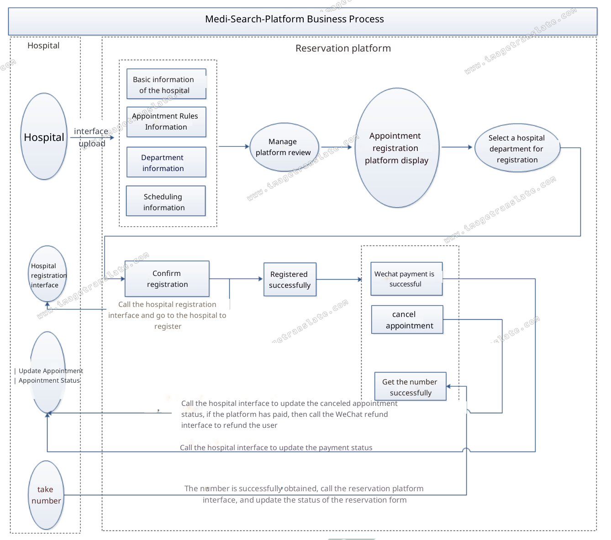

# Medi-Search-Platform

# Project Description
Medi-Search Platform is an online appointment registration system. Online appointment registration is a convenient medical service developed in recent years. It aims to alleviate the difficulty of seeing a doctor and registering a doctor. Seeing a doctor is not necessarily guaranteed. The appointment registration service provided by the online appointment registration service fundamentally solves this medical problem. Easy registration anytime, anywhere! No need to queue!

# Technology Stack
## Backend Technology
 **SpringBoot:** Simplify the initial construction and development process of new Spring applications 
 **SpringCloud:** A cloud-native application development tool based on Spring Boot, technologies used by SpringCloud: (SpringCloudGateway, Spring Cloud Alibaba Nacos, Spring Cloud Alibaba Sentinel, SpringCloud Task, SpringCloudFeign, etc.) 
 **MyBatis-Plus:** Persistence layer framework, ORM toools 
 **Redis:** memory cache 
 **RabbitMQ:** message middleware 
 **HTTPClient:** Http protocol client 
 **Swagger2:** Api interface documentation tool
 **Nginx:** load balancing
 **Lombok:**
 **Mysql:** relational database
 **MongoDB:** Document-Oriented NoSQL Database
## Front-end Technology
 **Vue.js:** A progressive framework for web interfaces
 **Node.js:** JavaScript runtime environment
 **Axios:** Axios is a promise-based HTTP library
 **npm:** Package Manager
 **Babel:** Transcoder
 **Webpack:** packaging tool
## Other
 **Docker:** container technology
 **Git:** code management tool

# Business Process

